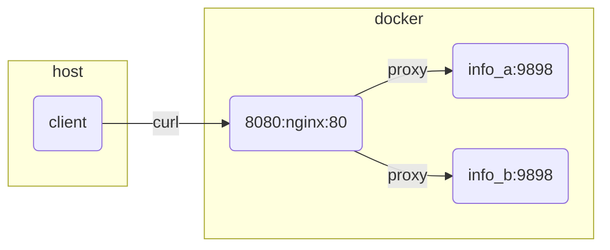

# README

Demonstrate a simple reverse proxy to manage build deployments

nginx ssl example [here](https://github.com/chrisguest75/sysadmin_examples/tree/master/19_letsencrypt)  

Demonstrates:

* Setting headers from environment variables.
* Using the built in template processing.
* Compose depends_on
* Round robin over list of backend
* Rewrites
* Return a generated /info page
* Header based routing to different backends

## Architecture



## Start

```sh
# start 
docker compose up -d
```

## Testing

```sh
# services without proxy (to enable this you need to comment back in the port mappings in the docker compose)
#curl -i http://0.0.0.0:9001/env          
#curl -i http://0.0.0.0:9002/env

# nginx reverse proxy
curl -i http://0.0.0.0:8080
curl -i http://0.0.0.0:8080/a/
curl -i http://0.0.0.0:8080/b/
curl -i http://0.0.0.0:8080/a/env
curl -i http://0.0.0.0:8080/b/env

# round robin
curl -i http://0.0.0.0:8080/c/env

# dynamic page
curl -i http://0.0.0.0:8080/info

# header based routing
# go to default (info_a)
curl -i http://0.0.0.0:8080/group
curl -i -H "group: unknown" http://0.0.0.0:8080/group/env   
# go to default (info_b)
curl -i -H "group: new" http://0.0.0.0:8080/group/env     
```

## Add header testing

add_header is completely overridden by the lowest level block 
`http` -> `server` -> `location`
Specifiying any add_header at a lower level will mean higher level add_headers do not apply.  Regardless of the header name.

```sh
# check for headers at each level
curl -i http://0.0.0.0:8080/a/env
```

## Debugging

```sh
# nginx
docker exec -it $(docker ps --filter name=44_reverse_proxy-nginx-1 -q) /bin/sh   

# logs from containers
docker logs $(docker ps --filter name=44_reverse_proxy-nginx-1 -q)
docker logs $(docker ps --filter name=44_reverse_proxy-info_a-1 -q)
docker logs $(docker ps --filter name=44_reverse_proxy-info_b-1 -q)

# get onto ubuntu container
docker exec -it $(docker ps --filter name=44_reverse_proxy-ubuntu-1 -q) /bin/sh

# reboot nginx
docker stop $(docker ps --filter name=44_reverse_proxy-nginx-1 -q) 
docker compose up -d
```

## Clean up

```sh
docker compose down
```

## Resources

* stefanprodan/podinfo [repo](https://github.com/stefanprodan/podinfo)  
* The Compose Specification [compose-spec](https://github.com/compose-spec/compose-spec/blob/master/spec.md)  
* podinfo cmdline options [here](https://github.com/stefanprodan/podinfo/blob/master/charts/podinfo/templates/deployment.yaml)  
* How to Deploy NGINX Reverse Proxy on Docker [here](https://phoenixnap.com/kb/docker-nginx-reverse-proxy)  
* Docker Networking overview [docker-networks](https://docs.docker.com/network/)  
* Docker network driver plugins [plugins_network](https://docs.docker.com/engine/extend/plugins_network/)  
