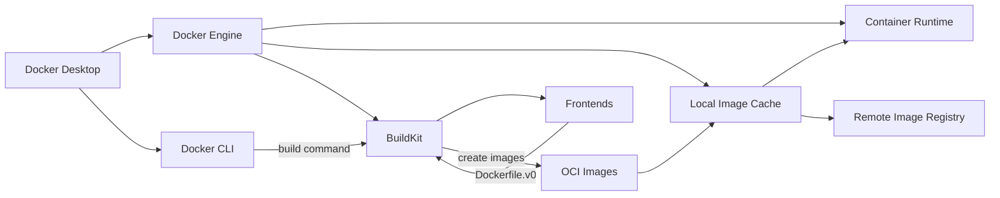

# Docker Examples and Demos

A repository for showing examples of different Docker related concepts and tools. Work through examples to demonstrate and prove concepts that exist.  

The aim is to use examples to show how Docker behaves when building containers and to highlight incorrect assumptions about behaviour.  

A list of things still to try and investigate [TODO.md](./TODO.md)  

## Checking changes in Docker

Docker is a fast moving project. If you want to keep check on the changes being made here are a few helpful links.  

* Check latest releases and commits into moby/buildkit repo [releases](https://github.com/moby/buildkit/releases)  
* Check latest releases and commits into docker/compose repo [repo](https://github.com/docker/compose)  
* Check latest releases and commits into containerd/containerd [repo](https://github.com/containerd/containerd)  
* The compose speciifcation [compose-spec/compose-spec](https://github.com/compose-spec/compose-spec)
* The OCI image specification [opencontainers/image-spec](https://github.com/opencontainers/image-spec/tree/main)
* The OCI runtime specification [opencontainers/runtime-spec](https://github.com/opencontainers/runtime-spec/blob/main/spec.md)
* The OCI distribution specification [opencontainers/distribution-spec](https://github.com/opencontainers/distribution-spec/blob/main/spec.md)
* The OCI blog [here](https://opencontainers.org/posts/blog/)  
* Check the docker blog [here](https://www.docker.com/blog/)  

## Docker Desktop Architecture

This diagram represents the following components and relationships:

* Docker Desktop: The main application that users interact with on their local machine.  
* Docker Engine: The core component responsible for managing containers and images.  
* Docker CLI: The command-line interface used to interact with Docker Engine.  
* BuildKit: The toolkit used for building and packaging software in containers.  
* Frontends: Components responsible for parsing build instructions and generating the build graph.  
* OCI Images: The format used for packaging software in containers.  
* Container Runtime: The runtime responsible for executing containers.  
* Local Image Cache: A storage location for container images on the local machine.  
* Remote Image Registry: A storage location for container images on remote servers.  

In the diagram, the Docker CLI sends a build command to BuildKit, which uses Frontends to parse the build instructions. BuildKit then creates OCI images, which are stored in the Local Image Cache. The Container Runtime can then execute these images as containers. The Local Image Cache can also interact with Remote Image Registries to fetch or push images.  

### Container Runtime

The container runtime is a crucial component in the container ecosystem, responsible for managing the life cycle of containers. Its primary responsibilities include:  

* Image Pulling: The container runtime fetches container images from local storage or remote image registries, such as Docker Hub or Google Container Registry. This ensures that the required image is available on the local system before container execution.  

* Image Unpacking: The container runtime unpacks the container image, which consists of layered file systems, into a coherent file system that can be used by the container during execution.  

* Container Creation: The container runtime creates containers by instantiating the appropriate resources, such as namespaces, cgroups, and file system mounts. It also sets up the necessary isolation and resource constraints to ensure that containers run in a secure and controlled environment.  

* Container Execution: The container runtime starts the container's main process and ensures that it runs in the specified environment, with the appropriate configurations and resource limitations.  

* Container Monitoring: The container runtime monitors the running containers for their health and status, allowing operators to track the performance and resource usage of their containers.  

* Container Stop/Start/Restart: The container runtime manages container life cycle operations such as stopping, starting, and restarting containers as needed or upon user request.  

* Container Deletion: The container runtime removes containers when they are no longer needed, cleaning up any associated resources and storage.  

* Container Logging: The container runtime captures and manages the logs generated by containers, making them accessible to operators for debugging and monitoring purposes.  

* Networking: The container runtime sets up and manages the network interfaces, connectivity, and isolation between containers and the host system, as well as between containers themselves.  

* Security: The container runtime is responsible for implementing security features such as user namespace isolation, seccomp, AppArmor, or SELinux profiles, ensuring that containers run in a secure environment.  

Popular container runtimes include Docker's containerd, Google's gVisor, and Red Hat's CRI-O. These runtimes often implement the Container Runtime Interface (CRI) to work with Kubernetes, allowing seamless container management within Kubernetes clusters.  

## Table of contents

- [Docker Examples and Demos](#docker-examples-and-demos)
  - [Checking changes in Docker](#checking-changes-in-docker)
  - [Docker Desktop Architecture](#docker-desktop-architecture)
    - [Container Runtime](#container-runtime)
  - [Table of contents](#table-of-contents)
  - [00 - Cheatsheet](#00---cheatsheet)
  - [00 - Troubleshooting](#00---troubleshooting)
  - [01 - Layers, Hiding and Squashing](#01---layers-hiding-and-squashing)
  - [01b - Mv, Rm, Sh](#01b---mv-rm-sh)
  - [02 - Host and Kernel details](#02---host-and-kernel-details)
  - [03 - Buildargs](#03---buildargs)
  - [04 - Docker Context](#04---docker-context)
  - [05 - Root user](#05---root-user)
  - [06 - Multistage small image size](#06---multistage-small-image-size)
  - [07 - Buildkit](#07---buildkit)
  - [08 - Layer caching with arguments](#08---layer-caching-with-arguments)
  - [09 - Kaniko](#09---kaniko)
  - [10 - Distro Versions](#10---distro-versions)
  - [11 - Parameters and piping passthrough](#11---parameters-and-piping-passthrough)
  - [12 - Background processes](#12---background-processes)
  - [13 - Users and permissions](#13---users-and-permissions)
  - [14 - CPU - control](#14---cpu---control)
  - [14 - OOM - Out of memory](#14---oom---out-of-memory)
  - [15 - ENTRYPOINT and CMD](#15---entrypoint-and-cmd)
  - [16 - Layer caching with non-deterministic executions](#16---layer-caching-with-non-deterministic-executions)
  - [17 - Microscanner](#17---microscanner)
  - [18 - Hadolint](#18---hadolint)
  - [19 - Locking versions with APT](#19---locking-versions-with-apt)
  - [20 - Building a rootfs image](#20---building-a-rootfs-image)
  - [21 - Nice prompts](#21---nice-prompts)
  - [22 - Example of using dockle](#22---example-of-using-dockle)
  - [23 - Building bash5 for Unbuntu 16.04](#23---building-bash5-for-unbuntu-1604)
  - [24 - Reverse shells](#24---reverse-shells)
  - [25 - Apparmor](#25---apparmor)
  - [26 - Sidecar debugging](#26---sidecar-debugging)
  - [27 - Readonly containers](#27---readonly-containers)
  - [28 - Distroless](#28---distroless)
  - [29 - Workflow feature flags](#29---workflow-feature-flags)
  - [30 - Dive CI Tool](#30---dive-ci-tool)
  - [31 - Structure Tests](#31---structure-tests)
  - [32 - File extraction](#32---file-extraction)
  - [33 - Label metadata](#33---label-metadata)
  - [34 - Build volume from S3](#34---build-volume-from-s3)
  - [34 - Simple volumes](#34---simple-volumes)
  - [34 - Volume images](#34---volume-images)
  - [35 - Layer Poisoning](#35---layer-poisoning)
  - [36 - Layers Speed Tests](#36---layers-speed-tests)
  - [37 - Registry Proxy](#37---registry-proxy)
  - [38 - Alpine APK](#38---alpine-apk)
  - [39 - SSH](#39---ssh)
  - [40 - SSL nginx](#40---ssl-nginx)
  - [41 - DevContainers](#41---devcontainers)
  - [41 - NodeJS DevContainers](#41---nodejs-devcontainers)
  - [42 - Docker systemd service](#42---docker-systemd-service)
  - [43 - Buildpacks](#43---buildpacks)
  - [44 - Reverse Proxy](#44---reverse-proxy)
  - [45 - Docker Scan](#45---docker-scan)
  - [46 - Docker in Docker (DinD)](#46---docker-in-docker-dind)
  - [48 - trivy](#48---trivy)
  - [49 - grype](#49---grype)
  - [51 - Signals](#51---signals)
  - [52 - docker-slim](#52---docker-slim)
  - [53 - seccomp and apparmor](#53---seccomp-and-apparmor)
  - [54 - semgrep](#54---semgrep)
  - [55 - multiarch](#55---multiarch)
  - [57 - ssh builds using ssh-agent](#57---ssh-builds-using-ssh-agent)
  - [56 - pyenv versions](#56---pyenv-versions)
  - [57 - Using SSH during build](#57---using-ssh-during-build)
  - [58 - Secrets API key](#58---secrets-api-key)
  - [59 - Compose V2 examples](#59---compose-v2-examples)
  - [60 - heredocs](#60---heredocs)
  - [61 - Using tmpfs](#61---using-tmpfs)
  - [63 - Build matrix using build args](#63---build-matrix-using-build-args)
  - [64 - SBOM](#64---sbom)
  - [68 - Composing Services](#68---composing-services)
  - [69 - Skopeo Inspecting Registries](#69---skopeo-inspecting-registries)
  - [70 - Scaling Compose](#70---scaling-compose)
  - [71 - cosign](#71---cosign)
  - [72 - Building images manually](#72---building-images-manually)
  - [73 - buildah](#73---buildah)
  - [74 - onbuild](#74---onbuild)
  - [75 - skaffold](#75---skaffold)
  - [76 - Building CPP tools in containers](#76---building-cpp-tools-in-containers)
  - [77 - healthchecks](#77---healthchecks)
  - [78 - multiple contexts](#78---multiple-contexts)
  - [79 - bake](#79---bake)
  - [80 - crane](#80---crane)
  - [81 - oras](#81---oras)
  - [84 - cache-from](#84---cache-from)
  - [85 - tini](#85---tini)
  - [86 - WASM/WASI](#86---wasmwasi)
  - [87 - Lazy Pulling](#87---lazy-pulling)
  - [89 - Managing Diskspace](#89---managing-diskspace)
  - [90 - Builders](#90---builders)
  - [91 - Buildkit Frontends](#91---buildkit-frontends)
  - [93 - Metadata](#93---metadata)
  - [98 - API Direct](#98---api-direct)

## 00 - Cheatsheet

Cheatsheet style helpers for common tasks.  
Steps [README.md](./00_cheatsheet/README.md)  

## 00 - Troubleshooting

Basic troubleshooting tips for installation and fixing issues.  
Steps [README.md](./00_troubleshooting/README.md)  

## 01 - Layers, Hiding and Squashing

Demonstrates how layers are stored, files are hidden and can be squashed.  
Steps [README.md](./01_layers_hiding/README.md)  

## 01b - Mv, Rm, Sh

** Not working!! **  
Building a simple container with mv, rm, sh.  Probably missing libs.  
Steps [README.md](./01b_mv_cp_rm/README.md)  

## 02 - Host and Kernel details

Demonstrates how kernel versions are different for build and execution.  
Steps [README.md](./02_host_and_kernel/README.md)  

## 03 - Buildargs

Demonstrate how buildargs are stored in the image.  Meaning anyone with access to the image will have access to the credentials.  With an example of new buildkit build time volume mounts to workaround this.  
Steps [README.md](./03_buildargs_storage/README.md)  

## 04 - Docker Context

Demonstrate how to work with Docker context.  
Steps [README.md](./04_docker_context/README.md)  

## 05 - Root user

Demonstrate root user and privilege inside the container.  
Steps [README.md](./05_root_user/README.md)  

## 06 - Multistage small image size

Demonstrate multistage build small image size  
Steps [README.md](./06_multistage/README.md)  

## 07 - Buildkit

Demonstrate buildkit parallel building  
Steps [README.md](./07_buildkit_parallelbuilds/README.md)  

## 08 - Layer caching with arguments

Demonstrate layer caching and how different build arguments values will not be cached until built.  
Steps [README.md](./08_caching_arguments/README.md)  

## 09 - Kaniko

Demonstrate using Kaniko to build a Docker image  
Steps [README.md](./09_kaniko/README.md)  

## 10 - Distro Versions

Demonstrate different ways to find distro versions inside a container  
Steps [README.md](./10_distro_versions/README.md)  

## 11 - Parameters and piping passthrough

Demonstrate passing parameters and piping into docker run.  
Steps [README.md](./11_cmdline_passthrough/README.md)  

## 12 - Background processes

Demonstrate creating background processes  
Steps [README.md](./12_background_processes/README.md)  

## 13 - Users and permissions

Users and permissions  
Steps [README.md](./13_users_and_permissions/README.md)  

## 14 - CPU - control

Demonstrate using the cpu limitations on containers.  
Steps [README.md](./14_cpu_control/README.md)  

## 14 - OOM - Out of memory

Demonstrate how Docker deals with an out-of-memory issue  
Steps [README.md](./14_out_of_memory/README.md)  

## 15 - ENTRYPOINT and CMD

Demonstrate how ENTRYPOINT and CMD differ  
Steps [README.md](./15_entrypoint_and_cmd/README.md)  

## 16 - Layer caching with non-deterministic executions

Demonstrate how layer caching works with non-determinstic commands.  
Steps [README.md](./16_cache_fails/README.md)  

## 17 - Microscanner

Demonstrate how to use Microscanner to detect vulnerabilities.  
Steps [README.md](./17_microscanner/README.md)  

## 18 - Hadolint

Demonstrate hadolint  
Steps [README.md](./18_hadolint/README.md)  

## 19 - Locking versions with APT

Demonstrate an apt locking technique  
Steps [README.md](./19_apt_locking/README.md)  

## 20 - Building a rootfs image

Demonstrates building a root image  
Steps [README.md](./20_build_root/README.md)  

## 21 - Nice prompts

Demonstrates configuring a nice prompt for `bash` and `zsh` inside a container  
Steps [README.md](./21_nice_prompts/README.md)  

## 22 - Example of using dockle

Demonstrates using dockle to find issues with images.  
Steps [README.md](./22_dockle/README.md)  

## 23 - Building bash5 for Unbuntu 16.04

Demonstrates building bash 5 on an ubuntu image.  
Steps [README.md](./23_bash5_ubuntu/README.md)  

## 24 - Reverse shells

Demonstrates getting access into a container  
Steps [README.md](./24_reverse_shell/README.md)  

## 25 - Apparmor

Demonstrates using Apparmor to restrict processes in a container.  
Steps [README.md](./25_apparmor/README.md)  

## 26 - Sidecar debugging

Demonstrates sidecar techniques for debugging  
Steps [README.md](./26_sidecar_debugging/README.md)  

## 27 - Readonly containers

Demonstrates a readonly container  
Steps [README.md](./27_readonly_containers/README.md)  

## 28 - Distroless

Demonstrates a distroless container build  
Steps [README.md](./28_distroless/README.md)  

## 29 - Workflow feature flags

A technique to use in CI systems where it is not possible to parameterise the workflow/pipeline.  
Steps [README.md](./29_workflow_feature_flags/README.md)  

## 30 - Dive CI Tool

Demonstrates using dive tool to analyse images.  
Steps [README.md](./30_dive_ci/README.md)  

## 31 - Structure Tests

Demonstrates how to use container structure testing.  
Steps [README.md](./31_structure_tests/README.md)  

## 32 - File extraction

Demonstrates copying data out of container images.  
Steps [README.md](./32_file_extraction/README.md)  

## 33 - Label metadata

Demonstrates adding label metadata to builds that helps us trace pipelines and build sources.  
Steps [README.md](./33_label_metadata/README.md)  

## 34 - Build volume from S3

Demonstrate how to build a data volume for use by other containers.  
Steps [README.md](./34_build_volume_from_s3/README.md)  

## 34 - Simple volumes

Demonstrates using simple volumes.  
Steps [README.md](./34_simple_volumes/README.md)  

## 34 - Volume images

Demonstrates how to configure an image that can be mounted as a volume into a container.  
Steps [README.md](./34_volume_images/README.md)  

## 35 - Layer Poisoning

Demonstrate how to inject file into multiple running containers from host.  
Steps [README.md](./35_layer_poisoning/README.md)  

## 36 - Layers Speed Tests

Demonstrates timing differences with layers building and running  
Steps [README.md](./36_layers_speed/README.md)  

## 37 - Registry Proxy

Demonstrate how to run a pull through registry proxy.  
Steps [README.md](./37_registry_proxy/README.md)  

## 38 - Alpine APK

Demonstrate how to install a custom package in Alpine.  
Steps [README.md](./38_alpine_apk/README.md)  

## 39 - SSH

Demonstrate how to use `ssh` inside a docker container  
Steps [README.md](./39_ssh/README.md)  

## 40 - SSL nginx

Create a self-signed ssl nginx endpoint for a container.  
Steps [README.md](./40_ssl_nginx/README.md)  

## 41 - DevContainers

Use remote-containers vscode extension  
Steps [README.md](./41_remote_containers/README.md)  

## 41 - NodeJS DevContainers

Use remote-containers vscode extension to create a nodejs and mongodb container  
Steps [README.md](./41_nodejs_remote_devcontainer/README.md)  

## 42 - Docker systemd service

Demonstrate how to use docker containers as systemd.  
Steps [README.md](./42_docker_systemd_service/README.md)  

## 43 - Buildpacks

Demonstrate how to use a build pack to build a simple Python container  
Steps [README.md](./43_buildpacks/README.md)  

## 44 - Reverse Proxy

Demonstrate a simple reverse proxy to manage build deployments  
Steps [README.md](./44_reverse_proxy/README.md)  

## 45 - Docker Scan

Demonstrate some examples of using `docker scan`.  
Steps [README.md](./45_docker_scan/README.md)  

## 46 - Docker in Docker (DinD)

Demonstrate how to use Docker in Docker  
Steps [README.md](./46_dind/README.md)  

## 48 - trivy

Demonstrate some examples of using `trivy`.  
Steps [README.md](./48_trivy/README.md)  

## 49 - grype

Demonstrate some examples of using `grype`.  
Steps [README.md](./49_grype/README.md)  

## 51 - Signals

Demonstrate how signals work in containers  
Steps [README.md](./51_signals/README.md)  

## 52 - docker-slim

Demonstrate dockerslim and how to use it to reduce container sizes.  
Steps [README.md](./52_dockerslim/README.md)  

## 53 - seccomp and apparmor

Demonstrate seccomp and apparmor and how to use them.  
Steps [README.md](./53_seccomp_and_apparmor/README.md)  

## 54 - semgrep

Demonstrate semgrep on dockerfile and other standard container resources  
Steps [README.md](./54_semgrep/README.md)  

## 55 - multiarch

Demonstrate building and running multi-arch images  
Steps [README.md](./55_multiarch/README.md)  

## 57 - ssh builds using ssh-agent

Demonstrate how to use an ssh mount during build.  
Steps [README.md](./57_ssh_build_with_sshagent/README.md)  

## 56 - pyenv versions

Demonstrate how to get `pyenv` installing a particular version in a container  
Steps [README.md](./56_pyenv_versions/README.md)  

## 57 - Using SSH during build

Demonstrate how to use an ssh mount during build.  
Steps [README.md](./57_ssh_build_with_sshagent/README.md)  

## 58 - Secrets API key

Demonstrate how to use a secrets mount during build (requires buildkit).  
Steps [README.md](./58_secrets_apikey/README.md)  

## 59 - Compose V2 examples

Demonstrate how to use docker compose v2.  
Steps [README.md](./59_composev2/README.md)  

## 60 - heredocs

Demonstrate how to use HEREDOC in a Dockerfile.  
Steps [README.md](./60_heredocs/README.md)  

## 61 - Using tmpfs

Demonstrate how to use `tmpfs` with Docker.  
Steps [README.md](./61_tmpfs/README.md)  

## 63 - Build matrix using build args

Demonstrate creating a build matrix from a single container.  
Steps [README.md](./63_build_matrix/README.md)  

## 64 - SBOM

Demonstrates SBOM generation for docker images.  
Steps [README.md](./64_sbom/README.md)  

## 68 - Composing Services

Demonstrate how to use docker compose to compose multiple services  
Steps [README.md](./68_composing_services/README.md)  

## 69 - Skopeo Inspecting Registries

Demonstrate using `Skopeo` to interrogate registries.  
Steps [README.md](./69_skopeo/README.md)  

## 70 - Scaling Compose

Demonstrate how to use docker compose scale.  
Steps [README.md](./70_scaling_compose/README.md)  

## 71 - cosign

Demonstrate `cosign` for signing OCI images.  
Steps [README.md](./71_cosign/README.md)  

## 72 - Building images manually  

Demonstrates how to build images manually.  
Steps [README.md](./72_build_image_manually/README.md)  

## 73 - buildah

Demonstrate how to use buildah (linux only).  
Steps [README.md](./73_buildah/README.md)  

## 74 - onbuild

Demonstrate using `ONBUILD` to control build steps.  
Steps [README.md](./74_onbuild/README.md)  

## 75 - skaffold

Demonstrate how to use `skaffold` for local development.  
Steps [README.md](./75_skaffold/README.md)  

## 76 - Building CPP tools in containers  

Building example CPP package (SOX) inside a docker container.  
Steps [README.md](./76_building_cpp_package/README.md)  

## 77 - healthchecks

Demonstrate how to use `docker compose` healthchecks.  
Steps [README.md](./77_healthchecks/README.md)  

## 78 - multiple contexts

Demonstrate how to use `docker buildx` with multiple contexts.  
Steps [README.md](./78_multi_context/README.md)  

## 79 - bake

Demonstrate how to use `bake` to build multiple images.  
Steps [README.md](./79_bake/README.md)  

## 80 - crane

Demonstrate how to use `crane`  
Steps [README.md](./80_crane/README.md)  

## 81 - oras

Demonstrate how to use OCI Registry-as-Storage (ORAS)  
Steps [README.md](./81_oras/README.md)  

## 84 - cache-from

Demonstrate how to use `--cache-from` to speed up builds.  
Steps [README.md](./84_cache_from/README.md)  

## 85 - tini

Demonstrate `tini` init-system in Docker to handle SIGTERM and SIGHALT correctly.  
Steps [README.md](./85_tini/README.md)  

## 86 - WASM/WASI

Demonstrate how to setup a WASI based container.  
Steps [README.md](./86_wasi/README.md)  

## 87 - Lazy Pulling

Demonstrate how to control buildkit to build images ordered for lazy pulls.  
Steps [README.md](./87_lazy_pulling/README.md)  

## 89 - Managing Diskspace

Give some examples and advice on how to manage disk space with docker.  
Steps [README.md](./89_managing_diskspace/README.md)  

## 90 - Builders

Demonstrate how to use docker builders.  
Steps [README.md](./90_builders/README.md)  

## 91 - Buildkit Frontends

Demonstrate how to use `docker frontends`.  
Steps [README.md](./91_buildkit_frontends/README.md)  

## 93 - Metadata

Demonstrate how the metadata output file works.  
Steps [README.md](./93_metadata/README.md)  

## 98 - API Direct

Demonstrate how to invoke the API directly.  
Steps [README.md](./98_api_direct/README.md)  
